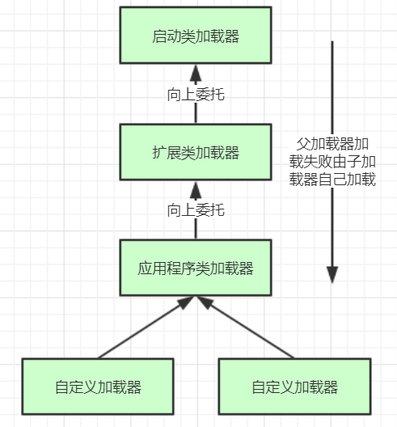

# JVM
## 一、类加载机制
### 1. 类加载过程
多个java文件经编译打包生成可运行jar包，最终由java命令运行某个**主类**的**main函数**启动程序。
首先，需要**通过类加载器把主类加载到JVM**。
主类在**运行过程中**如果要使用到其他类，会逐步加载这些类（**jar包里的类不是一次性全部加载的，是使用到时才加载的**）。

类加载到使用过程有如下几步：
**加载 >> 验证 >> 准备 >> 初始化 >> 使用 >> 卸载**
- 加载：在硬盘上查找并通过IO读入字节码文件，使用到类时才会加载（调用类的main方法，new对象等）
- 验证：校验字节码文件的正确性
- 准备：给类的静态变量分配内存，并赋予默认值（对象赋值为null，常量如int赋值为0）-- ***见常量池？***
- 解析：将符号引用替换为直接引用，该阶段会将一些静态方法（符号引用-比如main方法）替换为指向数据所存内存的指针或者句柄等（直接引用）
  这就是所谓的**静态链接**过程（类加载期间完成）
  **动态链接**是在程序运行期间完成符号引用替换为直接引用的过程
- 初始化：**将类的静态变量初始化为指定的值，执行静态代码块**


#### 类加载有趣示例（天坑）
== 见Module: jvm-classloader ==
##### - InvokeParentField.java
```java
/*
 * Module: jvm-classloader
 */
public class InvokeParentField {
    public static void main(String[] args) {
        System.out.println("---------->" + Son.num);
    }
}
class Parent {
    public static int num = 1;
    static {
        System.out.println("---------->2");
    }
}
class Son extends Parent {
    static {
        System.out.println("---------->3");
    }
}
```
输出结果：
```
---------->2
---------->1
```

##### - InvokeParentFinalField.java
```java
/*
 * Module: jvm-classloader
 */
public class InvokeParentFinalField {
    public static void main(String[] args) {
        System.out.println("---------->" + Son1.num);
    }
}
class Parent1 {
    public static final int num = 1;
    static {
        System.out.println("---------->2");
    }
}
class Son1 extends Parent1 {
    static {
        System.out.println("---------->3");
    }
}
```
输出结果：
```
---------->1
```

##### - InvokeParentFinalField2.java
```java
/*
 * Module: jvm-classloader
 */
public class InvokeParentFinalField2 {
    public static void main(String[] args) {
        System.out.println("---------->" + Son2.num);
    }
}
class Parent2 {
    public static final int num = new Random().nextInt();
    static {
        System.out.println("---------->2");
    }
}
class Son2 extends Parent2 {
    static {
        System.out.println("---------->3");
    }
}
```
输出结果：
```
---------->2
---------->945739838 // 任意int随机数
```

### 2. 类加载器与双亲委派
类的加载由类加载器实现，Java里有如下几种类加载器：
- 启动类加载器：负责加载支撑JVM运行，位于JRE的lib目录下的核心类库，如rt.jar、chartset.jar等
- 扩展类加载器：负责加载支撑JVM运行，位于JRE的lib目录下ext扩展目录中的jar包
- 应用程序类加载器：负责加载ClassPath路径下的类包，也就是用户自己写的类
- 自定义加载器：负责加载用户自定义路径下的类包

类加载示例：
==见com.leo.classloader.TestJDKClassLoader==

#### 2.1 自定义类加载器
实现一个自定义类加载器需要继承java.lang.ClassLoader类，该类有loadClass和findClass两个核心方法：
##### - loadClass(String, boolean)
loadClass方法实现了**双亲委派机制**，核心代码见：java.lang.ClassLoader.loadClass(java.lang.String, boolean)
```java
// First, check if the class has already been loaded
Class<?> c = findLoadedClass(name);
if (c == null) {
    long t0 = System.nanoTime();
    try {
        if (parent != null) {
            c = parent.loadClass(name, false);
        } else {
            c = findBootstrapClassOrNull(name);
        }
    } catch (ClassNotFoundException e) {
        // ClassNotFoundException thrown if class not found
        // from the non-null parent class loader
    }
```
##### - findClass(String)
findClass方法默认实现为抛出异常，因此，对于自定义加载器主要是**重写findClass方法**
```java
protected Class<?> findClass(String name) throws ClassNotFoundException {
    throw new ClassNotFoundException(name);
}
```
自定义类加载示例：
==见com.leo.classloader.MyClassLoaderTest==

#### 2.2 双亲委派机制
[核心代码请见](#--loadClass(String,-boolean))
##### - 核心流程
- 首先，检查指定名称的类是否已经加载过，如果加载过，就不需要再加载，直接返回
- 如果此类没有加载过，那么判断是否存在父加载器。如果有父加载器，则委托父加载器加载（即调用parent.loadClass(name, false);），或调用bootstrap类加载器加载
- 当父加载器及bootstrap类加载器都没找到指定的类，则调用当前类加载器的findClass方法来完成类加载



##### - 如何理解双亲委派机制的设计？
- 1. 避免类的重复加载：当父加载器已加载某类时，子加载器无需再加载一次，保证被加载类的**唯一性**
- 2. 沙箱安全机制：**防止核心API库被随意篡改*

==沙箱安全见jvm-classloader/src/main/java/java/lang/String.java==
```java
public class String {
    public static void main(String[] args) {
        System.out.println("**********My String Class**********");
    }
}
```
运行结果：
```
错误: 在类 java.lang.String 中找不到 main 方法, 请将 main 方法定义为:
   public static void main(String[] args)
否则 JavaFX 应用程序类必须扩展javafx.application.Application
```

### 3. 打破双亲委派
#### 尝试打破双亲委派
基于上述自定义String类无法加载，尝试打破双亲委派以实现使用自定义加载器加载
==见com.leo.classloader.MyClassLoaderTest2==
重写类加载方法loadClass(String, boolean)，不委派给双亲加载。核心代码：
```java
// First, check if the class has already been loaded
Class<?> c = findLoadedClass(name);
long t0 = System.nanoTime();
if (c == null) {
    // to find the class.
    long t1 = System.nanoTime();
    c = findClass(name);
}
```
运行结果：
```
Exception in thread "main" java.lang.SecurityException: Prohibited package name: java.lang
	at java.lang.ClassLoader.preDefineClass(ClassLoader.java:655)
	at java.lang.ClassLoader.defineClass(ClassLoader.java:754)
```
分析：
报安全异常，禁止的包名称：java.lang。就结果而言，此时已打破双亲委派尝试加载自定义String类。
显然jdk对核心类库有安全保护机制，并不允许外部随意加载。同时，运行结果也正印证了这一点。